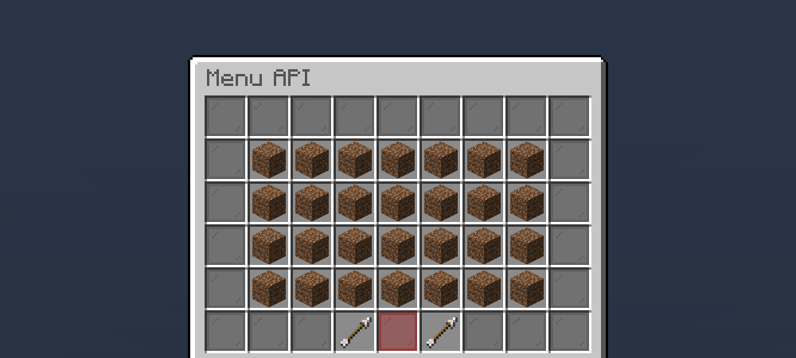

# MenuAPI

<div style="text-align:center">

</div>

<div style="text-align:center">


</div>

<div style="text-align:center">
<b>This plugin is for developers only, if you're a server owner then this isn't intended for you.</b>
</div>

MenuAPI facilitates you the creation of menu through inventories. The process is really simple and the API contains some default classes to minimize the code you need to write.

__The wiki isn't ready yet, so if you need to use a specific functionality check out the source code on GitHub.__

### Maven
```xml
<repositories>
    <repository>
        <id>jitpack.io</id>
        <url>https://jitpack.io</url>
    </repository>
</repositories>

<dependencies>
    <dependency>
        <groupId>com.github.stack9</groupId>
        <artifactId>MenuAPI</artifactId>
        <version>v1.3.0</version>
    </dependency>
</dependencies>
```

### Gradle

```groovy
repositories {
    maven { url 'https://jitpack.io' }
}

dependencies {
    implementation 'com.github.stack9:MenuAPI:v1.3.0'
}
```

### Usage
```java
package me.example.project;

import org.bukkit.Bukkit;
import org.bukkit.Material;
import org.bukkit.inventory.ItemStack;
import it.stack9.menuapi.menu.*;

public class Example {
    public static void main(String[] args) {
        Player player = Bukkit.getServer().getOnlinePlayers()[0];
        
        Menu menu = MenuFactory.create("Test menu", Menu.CHEST_SIZE, new SimpleMenuListener() {
            @Override
            public void onSelect(Menu menu, Player player, Option selection) {
                player.sendMessage("You selected the option #" + selection.getId());
            }
        });
        
        menu.setOption(4, new Option(1, new ItemStack(Material.DIRT)));
        
        menu.open(player);
    }
}
```
